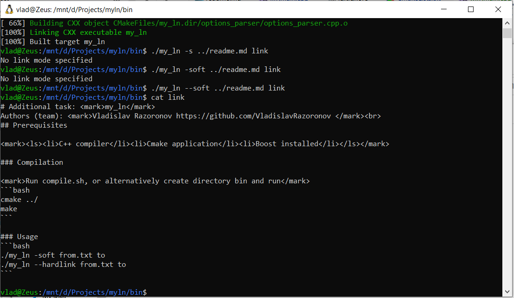

# Additional task: <mark>my_ln</mark>
Authors (team): <mark>Vladislav Razoronov https://github.com/VladislavRazoronov </mark><br>
## Prerequisites

<mark><ls><li>C++ compiler</li><li>Cmake application</li><li>Boost installed</li></ls></mark>

### Compilation

<mark>Run compile.sh, or alternatively create directory bin and run</mark>
```bash
cmake ../
make
```

### Usage
```bash
./my_ln -soft from.txt to
./my_ln --hardlink from.txt to
```
### Results


### Additional tasks
Added platform dependant compilation on Windows on linux with implementation based on WinAPI